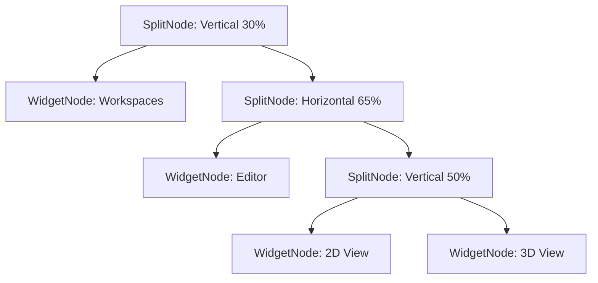

# Track Specification: Blender-Inspired Flexible Window Layout and 3D Projection

## 1. Overview
The Holds visual workspace currently uses a hardcoded 50/50 dual-pane split layout. While functional, it does not support advanced workflows where developers need to customize, partition, or view multiple aspects (such as simultaneous 2D and 3D perspectives, text specifications, and workspace management panels) simultaneously. 

This specification introduces a flexible, customizable tiling and widget window manager inspired by Blender's interface, built entirely in Svelte 5 with TypeScript.

## 2. Functional Requirements

### 2.1 Svelte 5 Layout State Model
- Represent the workspace layout as a binary partition tree (`LayoutNode`):
  - **Split Nodes:** Divide a bounding box vertically or horizontally, with a configurable division percentage (`percent: number`, 0 to 100).
  - **Widget Nodes:** Represent a leaf window pane rendering a specific widget type and holding a unique id.
- Built using Svelte 5 runes (`$state`, `$derived`) to make layout state fully reactive.

### 2.2 Workspaces Panel (Side-panel / Menu Widget)
- List predefined projections/workspaces.
- Each item must display its **Name** and a **Last Updated Date**.
- Selecting a workspace loads the pre-populated H-Cypher code and configures the editor/viewports accordingly.

### 2.3 Existing Features Wrap & Preserves
- Embed `HCypherEditor.svelte` inside the widget structure.
- Embed `CanvasRenderer` 2D canvas inside the widget structure.
- Maintain full functional parity with:
  - The **Smart SSR Simulator Controls** (Template Selection, H-Patch Refactoring, swap A+B, Flatten Ifs, Safe Swap).
  - The **Action Controls** (Trigger Transition, Proof Execution Trace, Inject Atom, Clear).
  - Selection inspector overlay card on active elements.

### 2.4 New 3D Perspective Projection Widget
- Create `View3D.svelte` rendering a 3D perspective topology on an HTML5 2D Canvas.
- Projects 3D node coordinates $(X, Y, Z)$ into 2D space $(x_{proj}, y_{proj})$ using camera and depth division formulas.
- Interactive mouse dragging to rotate the 3D graph dynamically around X and Y axes.
- Nodes are rendered as spheres (using shaded radial gradients) scaled by depth.
- Membranes are rendered as rotating wireframe circular orbits or halos wrapping member nodes.

### 2.5 Resizing and Drag & Drop
- **Resizing:** Users can drag the splitter boundaries between panels to adjust sizes instantly.
- **Drag & Drop:** Users can drag widget header handles and drop them over other panels to swap views/types dynamically.
- **Splitting/Joining:** Headers include split icons to horizontally or vertically divide any panel, and close buttons to dissolve panels.

## 3. Acceptance Criteria
- [ ] No regression on compiler checks: `npm run check` compiles cleanly with zero TypeScript or Svelte errors.
- [ ] `npm test` continues to compile and execute 100% of headless tests successfully.
- [ ] Drag-and-resize of pane borders functions smoothly across all split levels.
- [ ] Drag-and-drop of header handles successfully swaps pane widget types.
- [ ] Predefined workspaces load and update code and simulators properly.
- [ ] 3D View projects and rotates on drag successfully.
