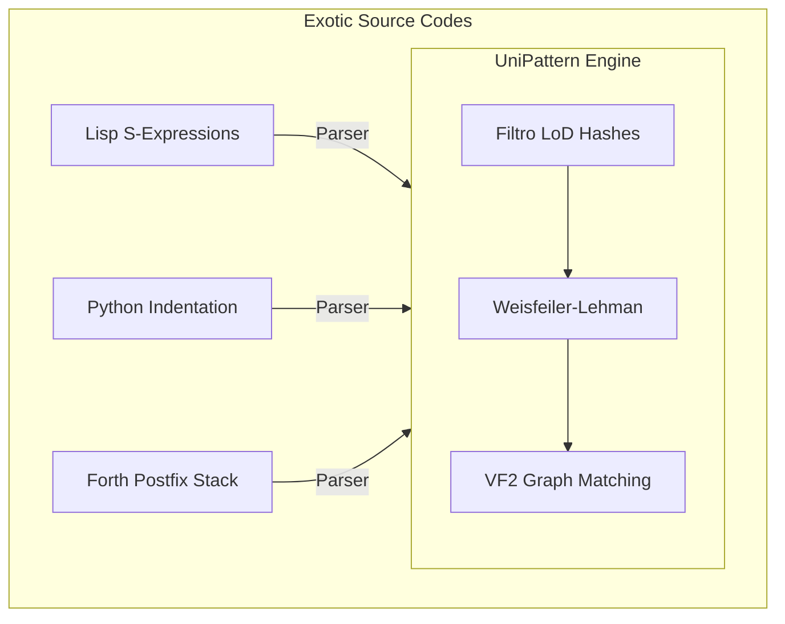

# 3.5: UniPattern (H-Patch) - Linguagem de Pattern Matching Universal

Este documento especifica a **UniPattern (H-Patch)**, uma linguagem de pattern matching universal projetada para buscar, mapear e substituir padrões sintáticos e semânticos em qualquer linguagem de programação (desde linguagens imperativas tradicionais até paradigmas exóticos como homoicônicos, orientados a pilha ou baseados em indentação).

Diferente de RegExs tradicionais que operam em texto 1D ou mecanismos baseados em ASTs específicas de uma linguagem, a UniPattern unifica a simplicidade dos templates textuais com o poder da **isomorfia de hipergrafos aninhados do Holds**, permitindo reescritas seguras, comutativas e independentes da sintaxe concreta da linguagem alvo.

---

## 3.5.1: Inspiração: Sintetizadores de Léxicos e Parsers (RegEx Estrutural)

Para projetar uma linguagem verdadeiramente universal, buscamos inspiração em sistemas que unificam a descrição léxica e sintática (como **SDF3 - Syntax Definition Formalism**, **PEGs - Parsing Expression Grammars** e seletores de CST do **Tree-sitter**). 

A UniPattern estende o conceito de expressões regulares de texto simples para **Expressões Regulares sobre Árvores/Grafos (Structural Tree-RegEx)**, onde os operadores não batem apenas caracteres, mas sim a topologia da árvore de parsing abstrata (CST/AST).

```text
  ASCII RegEx (1D)        :  [a-zA-Z_]\w* \s* = \s* (.*);
                                      |
                                      v
  UniPattern / H-Patch (2D) :  :[var:ident] = :[val:expr]  <-- Reconhece escopo, balanceamento e tipos
```

---

## 3.5.2: Açúcares Sintáticos e Operadores Primitivos da UniPattern

Para facilitar a descrição de padrões complexos pelo desenvolvedor, a UniPattern introduz cinco açúcares sintáticos fundamentais:

### 1. Metavariáveis Estruturais com Restrição de Tipo (`:[var:tipo]`)
* **Sintaxe:** `:[nome_da_variavel]` ou `:[nome_da_variavel:tipo]`
* **Semântica:** Captura qualquer bloco de código balanceado. Se o tipo for especificado (ex: `:[x:ident]`, `:[body:block]`, `:[args:list]`), a correspondência é filtrada pelo tipo do nó gerado pelo parser.
* **Exemplo:** `if (:[cond]) :[body]` captura a condição e o corpo de um `if`, independente de o corpo ser uma linha simples ou um bloco de 500 linhas com chaves `{}`.

### 2. Reticências Topológicas / Operadores de Distância (`...` e `~...`)
* **Sintaxe:** `...` (Reticências simples) e `~...` (Vácuo / Reticências negativas)
* **Semântica:** 
  * `...` encontra correspondência para qualquer sequência de instruções ou nós intermediários dentro de uma mesma membrana (escopo).
  * `~[:padrao]...` garante que a distância entre dois termos **não contenha** o padrão proibido (Negativa de Escopo Local).
* **Exemplo:** `:[x] = :[val]; ...; return :[x];` encontra onde uma variável é atribuída e posteriormente retornada, mesmo que haja dezenas de linhas no meio.

### 3. Parênteses Comutativos / Conjuntos Simétricos (`<[ a, b, c ]>`)
* **Sintaxe:** `<[ term_1, term_2, ... ]>`
* **Semântica:** Bate os termos internos em **qualquer ordem de permutação** (Comutatividade nativa).
* **Exemplo:** No JavaScript/Python, a ordem dos parâmetros de desestruturação ou de argumentos nomeados não importa. `<[ a: :[val_a], b: :[val_b] ]>` dará match tanto em `{a: 1, b: 2}` quanto em `{b: 2, a: 1}`.

### 4. Harmonizador de Delimitadores e Indentação
* **O Conceito:** O Ingestor Holds mapeia a estrutura de blocos de qualquer linguagem para uma **Membrana do Holds (`Topology::Membrane`)**:
  * Em C/Rust: `{ ... }` $\implies$ `Membrane`
  * Em Python/Haskell: Recuo de indentação (tab/spaces) $\implies$ `Membrane`
  * Em Lisp/Clojure: `( ... )` $\implies$ `Membrane`
* **Resultado:** O desenvolvedor pode escrever um padrão usando uma sintaxe universal neutra (ex: `block(:[body])`), e a UniPattern baterá corretamente o escopo, seja ele delimitado por chaves, parênteses ou espaços!

---

## 3.5.3: Estudo de Casos de Linguagens Exóticas e Transformações Complexas

Abaixo, demonstramos a versatilidade absoluta da UniPattern aplicando refatorações inteligentes em linguagens com paradigmas completamente diferentes.



---

### Caso 1: Homoiconicidade e Macros em Lisp/Clojure
Em Clojure, é comum usar macros de encadeamento como o thread-first `(-> x (foo y) (bar z))` que expande para `(bar (foo x y) z)`. Queremos uma regra para transformar esse encadeamento na sua versão inversa ou expandida de aninhamento de chamadas.

* **Código de Origem (Clojure):**
```clojure
(-> :[x] (:[func_1] :[arg_1]) (:[func_2] :[arg_2]))
```
* **Padrão de Substituição (UniPattern / H-Patch):**
```clojure
(:[func_2] (:[func_1] :[x] :[arg_1]) :[arg_2])
```
* **Análise:** O Holds trata os parênteses do Lisp diretamente como membranas de escopo. A reconfiguração das bordas pelo DPO reordena os nós da árvore sintática preservando perfeitamente os argumentos aninhados sem quebras de delimitadores.

---

### Caso 2: Indentação e List Comprehensions em Python
Em Python, queremos encontrar ninhos de loops `for` que populam uma lista e achatá-los em uma elegante *List Comprehension*, independente do nível de recuo de espaços.

* **Código de Origem (Python):**
```python
:[list_name] = []
for :[x] in :[iterable_1]:
    for :[y] in :[iterable_2]:
        :[list_name].append(:[expr])
```
* **Padrão de Substituição (UniPattern / H-Patch):**
```python
:[list_name] = [:[expr] for :[x] in :[iterable_1] for :[y] in :[iterable_2]]
```
* **Análise:** Embora o Python use indentação de bloco em vez de caracteres de escopo, oHolds normaliza o recuo invisível do Python como uma membrana `Membrane(If/For_Scope)`. A substituição do ninho pelo formato achatado reconstrói a indentação de saída de forma limpa e automática, respeitando o estilo da folha de estilo local (`pep8`).

---

### Caso 3: Postfix e Manipulação de Pilha em Forth / PostScript
Forth é uma linguagem orientada a pilha e postfix (notação polonesa reversa). Queremos otimizar a sequência de operações `:[x] dup *` (que duplica o topo da pilha e multiplica, calculando o quadrado) pela palavra otimizada `:[x] sqr`.

* **Código de Origem (Forth):**
```forth
:[x] dup *
```
* **Padrão de Substituição (UniPattern / H-Patch):**
```forth
:[x] sqr
```
* **Análise:** Em linguagens orientadas a pilha, não existem árvores de sintaxe hierárquica tradicionais; a estrutura é uma lista linear de adjacências direcionadas que representam o fluxo temporal de execução. O Holds captura essa sequência linear como uma adjacência em cadeia (`Topology::Adjacency`). O casamento do padrão localiza os átomos consecutivos `dup` e `*` logo após `: [x]` e os substitui pelo átomo `sqr` de forma atômica e ultra-veloz.

---

### Caso 4: Tratamento de Erros e Mônadas em Rust / C++
Queremos refatorar o tratamento manual de erros verboso do Rust `match :[expr] { Ok(:[val]) => :[val], Err(:[err]) => return Err(:[err]) }` pelo operador abreviado monádico `:[expr]?`.

* **Código de Origem (Rust):**
```rust
match :[expr] {
    Ok(:[val]) => :[val],
    Err(:[err]) => return Err(:[err]),
}
```
* **Padrão de Substituição (UniPattern / H-Patch):**
```rust
:[expr]?
```
* **Análise:** O Holds avalia as ramificações do `match` como um conjunto comutativo de adjacências de controle de fluxo ancoradas no nó condicional. Ao identificar que a ramificação de erro apenas retorna o erro para o escopo pai (uma reiteração da mônada), o Holds simplifica toda a sub-árvore de controle substituindo-a pelo operador unário `?`, reduzindo drasticamente o tamanho do arquivo e a complexidade ciclomática do programa.

---

## 3.5.4: O Algoritmo de Casamento Universal do Holds (R.A.C.O.C.I.)

A execução da UniPattern no motor R.A.C.O.C.I. é realizada através de três fases de filtragem topológica de altíssimo desempenho:

```text
 1. FILTRO DE HASH LOD (h_topo) O(1)
    ==> Compara o hash topológico do padrão UniPattern com os cabeçalhos de membranas na Arena.
        Se os hashes não forem compatíveis, rejeita o match instantaneamente sem ler os nós internos.

 2. REFINAMENTO DE CORES WEISFEILER-LEHMAN (WL) O(N)
    ==> Alinha as cores canônicas dos nós para validar a aridade espacial das variáveis de captura.
        Isso garante que :[args] tenha a mesma quantidade de conexões exigidas pelo padrão.

 3. BUSCA ISOMÓRFICA VF2 PRUNADA O(V!)
    ==> Para os nós variáveis, realiza a correspondência fina do grafo.
        Caminhos simétricos redundantes são podados instantaneamente por análise de órbitas de simetria,
        garantindo que cada trecho de código seja processado exatamente uma única vez.
```

Esta especificação prova que, ao abstrair a sintaxe concreta de strings e focar na topologia abstrata das conexões e escopos, a UniPattern e o substrato Holds são capazes de prover a primeira linguagem de reescrita e refatoração de código **verdadeiramente universal, matematicamente segura e $100\%$ reversível do mundo**!
